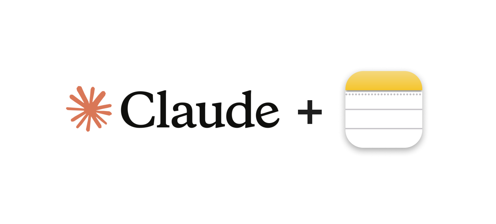
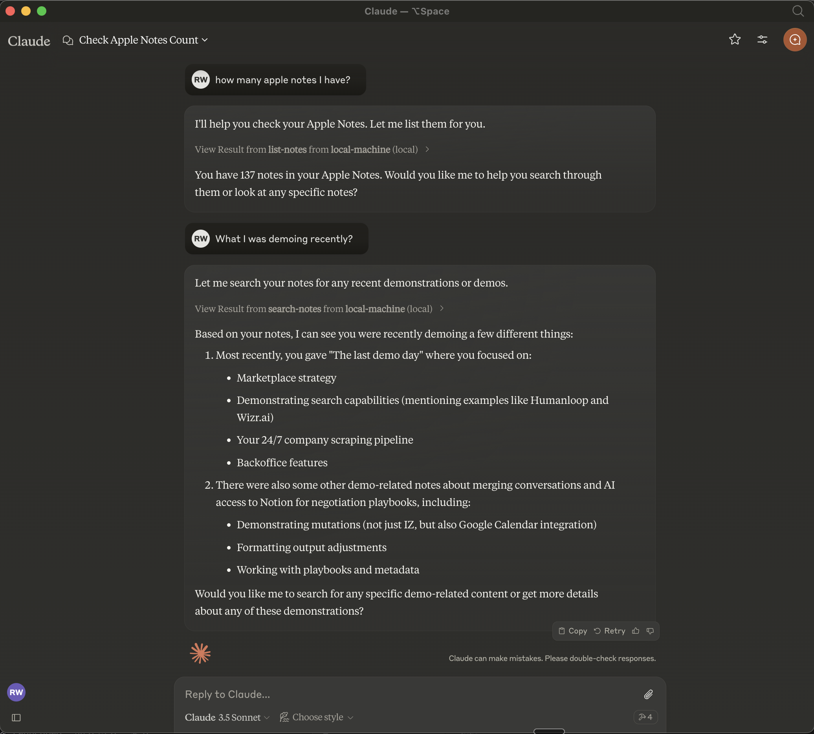
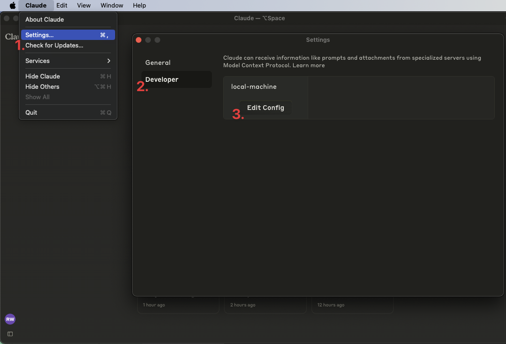

# MCP Apple Notes



A [Model Context Protocol (MCP)](https://www.anthropic.com/news/model-context-protocol) server that enables AI assistants like Claude to search and interact with your Apple Notes during conversations.



## Features

- 🔍 Native Apple Notes search integration across all notes
- 📝 Full access to note content and metadata from all folders
- 🍎 Native Apple Notes integration via JXA
- 🤖 MCP-compatible server for AI assistant integration
- 📁 Created notes are organized in dedicated folders ("MCP Notes" and "AI Memories")
- 🧠 Use Apple Notes as a memory bank for any AI assistant
- 🏷️ Tag-based organization for memories
- 🏃‍♂️ Fully local execution - no API keys needed

## Prerequisites

- [Bun](https://bun.sh/docs/installation)
- [Claude Desktop](https://claude.ai/download) or [Cursor](https://cursor.sh/)

## Installation

### Option 1: Direct from GitHub (Recommended)

You can install and run the MCP server directly using Bun's package execution feature:

```bash
bunx git+https://github.com/sunfmin/mcp-apple-notes
```

### Option 2: Manual Installation

1. Clone the repository:

```bash
git clone https://github.com/sunfmin/mcp-apple-notes
cd mcp-apple-notes
```

2. Install dependencies:

```bash
bun install
```

3. Run the server:

```bash
bun start
```

## Usage with Claude Desktop

1. Open Claude desktop app and go to Settings -> Developer -> Edit Config



2. Open the `claude_desktop_config.json` and add the following entry:

```json
{
  "mcpServers": {
    "local-machine": {
      "command": "/Users/<YOUR_USER_NAME>/.bun/bin/bun",
      "args": ["x", "git+https://github.com/sunfmin/mcp-apple-notes"]
    }
  }
}
```

Important: Replace `<YOUR_USER_NAME>` with your actual username.

## Usage with Cursor

1. Open Cursor and go to Settings -> Claude AI MCP
2. Add the following command:

```
bunx git+https://github.com/sunfmin/mcp-apple-notes
```

## Getting Started

1. Restart Claude desktop app or Cursor. You should see a connection status indicator.
2. Start using your notes! You can:
   - List all your notes (from all folders)
   - Search through your notes (across all folders)
   - View note contents
   - Create new notes (will be placed in the "MCP Notes" folder)
   - Store memories for AI assistants (will be placed in the "AI Memories" folder)
   - Retrieve AI memories based on queries

## Using Apple Notes as a Memory Bank for AI Assistants

This implementation allows you to use Apple Notes as a persistent memory bank for AI assistants like Claude Desktop, Cursor, Windsurf, and others. Here's how to use it:

### Storing Memories

You can store information, context, or any data as memories in the "AI Memories" folder:

```
// Example of storing a memory
I'll remember this information about your project structure.
```

The AI assistant will automatically create a note with the relevant information and store it in the "AI Memories" folder.

### Retrieving Memories

You can retrieve previously stored information by asking about topics:

```
// Example of retrieving memories
What do you remember about our project structure?
```

The AI assistant will search the "AI Memories" folder for relevant notes and provide the information.

### Using Tags

When storing memories, you can optionally add tags to categorize the information:

```
// Example of storing a tagged memory
Remember this API documentation with tags: api, documentation, reference
```

This makes it easier to organize and retrieve related memories.

## Troubleshooting

To see logs:

```bash
tail -n 50 -f ~/Library/Logs/Claude/mcp-server-local-machine.log
# or
tail -n 50 -f ~/Library/Logs/Claude/mcp.log
```

## Todos

- [ ] Apple notes are returned in the HTML format. We should turn them to Markdown and embed that
- [ ] Add support for note attachments and images
- [x] Organize notes in a dedicated folder
- [ ] Add support for note deletion and updates
- [x] Add support for using Apple Notes as a memory bank for AI assistants
